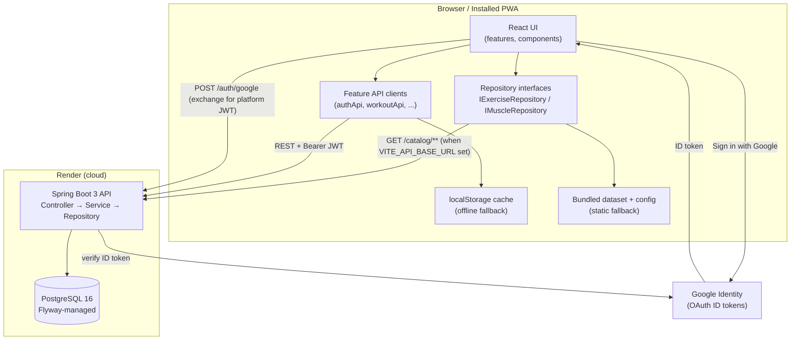
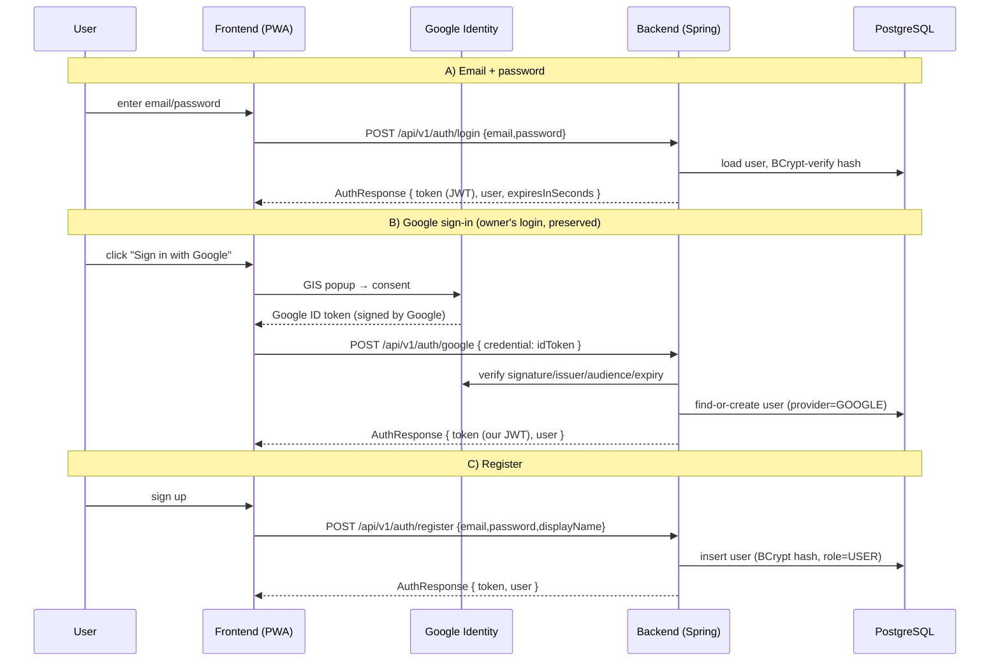
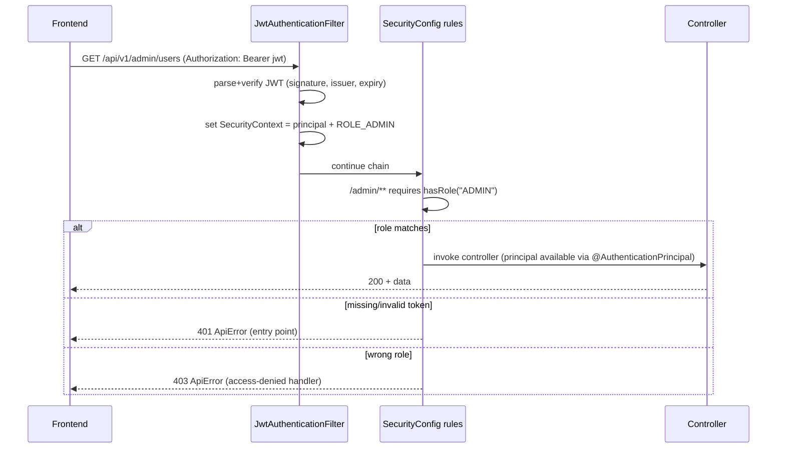
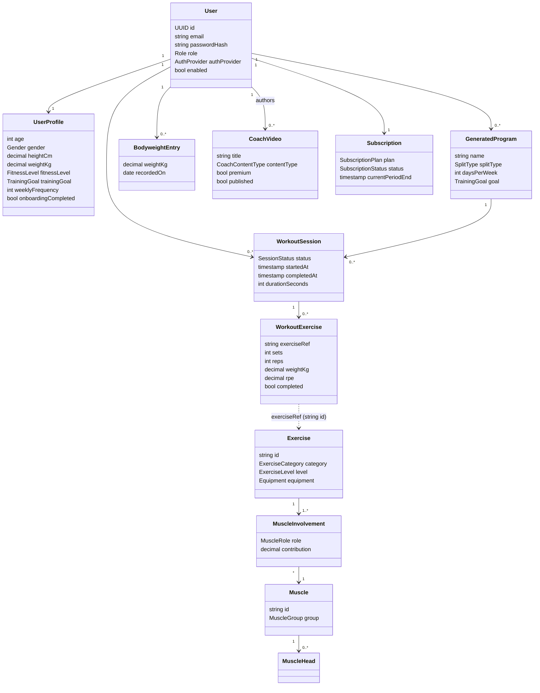
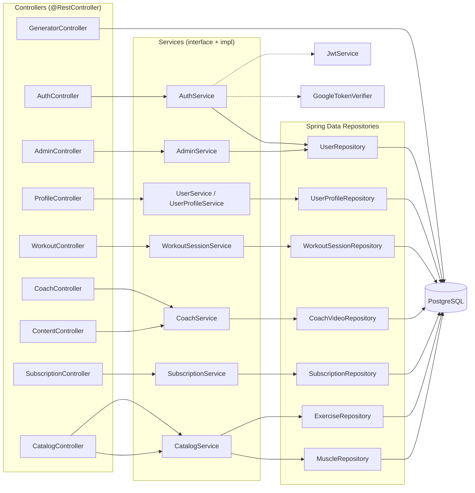
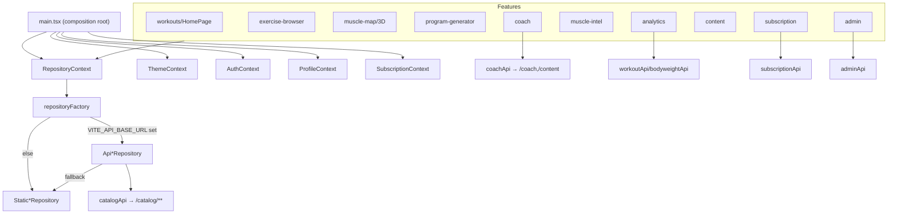
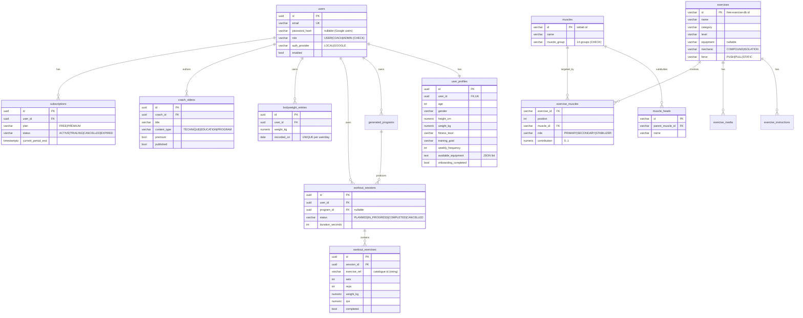
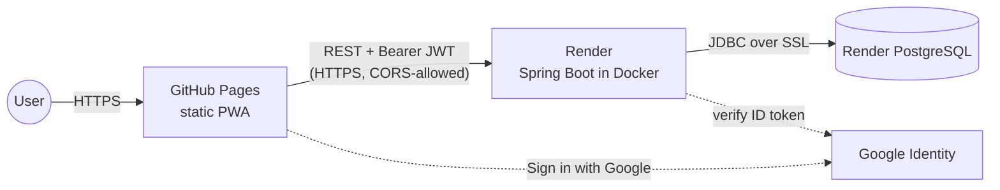

# MuscleMap — Complete Guide & Defense Dossier

> **Audience:** a PFA jury member, a new developer joining the project, and the project
> owner preparing for the defense. This single document is written so you can explain and
> justify **every** technical and non-technical decision without re-reading the codebase.
>
> **Status:** PFA Evolution Sprint complete (EM1–EM12) + catalogue migration (EM13).
> Frontend live on GitHub Pages; Spring Boot 3 backend + PostgreSQL live on Render
> (https://musclemap-q65o.onrender.com).
> **Live demo:** https://omar692002.github.io/musclemap/

---

## Table of Contents

- [Executive Summary](#executive-summary)
- [Problem Statement (Problématique)](#problem-statement-problématique)
- [Motivation (Technical & Business)](#motivation-technical--business)
- [Part 1 — Technical Guide](#part-1--technical-guide)
  - [1. High-Level Architecture](#1-high-level-architecture)
  - [2. Project Structure Walkthrough](#2-project-structure-walkthrough)
  - [3. File-by-File Overview](#3-file-by-file-overview)
  - [4. Design Patterns Used](#4-design-patterns-used)
  - [5. Libraries & Frameworks](#5-libraries--frameworks)
  - [5b. Authentication Deep Dive](#5b-authentication-deep-dive-mandatory)
  - [6. UML & Architecture Diagrams](#6-uml--architecture-diagrams)
  - [7. Database Documentation](#7-database-documentation)
  - [8. API Documentation](#8-api-documentation)
- [Part 2 — Non-Technical User Guide](#part-2--non-technical-user-guide)
- [Part 3 — Developer Guide](#part-3--developer-guide)
  - [Local Setup](#local-setup)
  - [IntelliJ Database Configuration](#intellij-database-configuration-step-by-step)
  - [Deployment Guide](#deployment-guide)
- [Appendix — Likely Defense Questions & Answers](#appendix--likely-defense-questions--answers)

---

# Executive Summary

**MuscleMap** is a mobile-first fitness **PWA** (Progressive Web App) backed by a **Spring Boot 3
+ PostgreSQL** API. Its differentiator — its *moat* — is **muscle visualization**: for every
exercise it shows *exactly* which muscles (down to the individual muscle head, on a rotatable
3D anatomy model) are trained as **primary**, **secondary**, or **stabilizer**. Around that
core it offers an 873-exercise catalogue with 100% video coverage, an interactive 3D body map,
a workout-program generator, workout tracking, progress analytics, evidence-based "muscle
intelligence" (volume/recovery landmarks), a coach content platform, an admin platform, and a
FREE/PREMIUM subscription layer.

| Dimension | Choice | One-line justification |
|---|---|---|
| **Frontend** | React 19 + TypeScript + Vite + Tailwind v4, PWA | One codebase → web + installable app → native via Capacitor later |
| **Backend** | Spring Boot 3.3 (Java 17), layered Clean Architecture | Industry-standard, strong typing, the academic "real backend" requirement |
| **Database** | PostgreSQL 16, schema owned by **Flyway** | Versioned, reproducible schema; no surprise auto-migrations |
| **Auth** | Stateless **JWT** (HS256) + **BCrypt** + **Google OAuth** | Scales horizontally (no server session), keeps the owner's Google sign-in |
| **Frontend host** | GitHub Pages (static) | Free, push-to-deploy, no server needed for the PWA |
| **Backend host** | Render (Docker), portable to ACR/AKS | Free tier now; same image runs on Kubernetes at scale, no rewrite |
| **Architecture seam** | Repository interfaces (`IExerciseRepository`…) | The app talks to *interfaces*; static-JSON ↔ API is a drop-in swap (zero UI change) |

**The single most important architectural idea** to remember for the defense: the UI never
talks to a concrete data source. It talks to **interfaces**. That is what lets the same app run
fully offline on GitHub Pages (bundled JSON) *and* against the live backend (REST API) with no
UI change — the "dual-path" design that appears again and again below.

**The project's history in one line:** it began as a Tier-0 MVP (static PWA, milestones M0–M4),
then went through a 12-milestone "PFA Evolution Sprint" (EM1–EM12) that added the real backend,
auth, onboarding, dashboards, tracking, analytics, muscle intelligence, admin, coach, and
subscriptions, and finally a catalogue migration (EM13) that moved the exercise/muscle data into
the database while preserving the offline fallback.

---

# Problem Statement (Problématique)

### What problem does MuscleMap solve?

Most people who train — beginners and even experienced lifters — **do not actually know which
muscles a given exercise trains**, or how *much* each muscle is involved. They follow programs
mechanically without understanding the "why". This causes three concrete failures:

1. **Imbalanced training & blind spots.** People over-train showy muscles (chest, biceps) and
   neglect others (posterior chain, stabilizers), leading to plateaus, poor aesthetics, and
   injury risk.
2. **Redundant, inefficient programs.** Self-made routines accidentally hammer the same muscle
   group on consecutive days without recovery, or duplicate movements that hit identical muscles.
3. **No feedback loop.** Without tracking *effective volume per muscle group* over a week, you
   cannot tell whether you're under-training (below the minimum effective volume) or
   over-training (past the maximum recoverable volume).

MuscleMap attacks all three: it **makes muscle involvement visible**, it **generates balanced,
non-redundant programs** with built-in recovery spacing, and it **tracks weekly effective sets
per muscle group against evidence-based landmarks**.

### Why would users need this application?

- A **beginner** needs to learn anatomy and see, concretely, what "leg day" actually trains.
- An **intermediate lifter** wants to find and fix weak points (e.g. "I never train my rear
  delts") using the body map and the muscle-intelligence heatmap.
- A **busy person** wants a balanced weekly program generated in seconds instead of researching.
- A **coach's client** wants the coach's own demonstration videos and programs in one place.

### What limitations exist in current solutions?

| Existing tool | Limitation MuscleMap removes |
|---|---|
| **Hevy / Strong** (trackers) | Great logging, but **no muscle visualization** and no anatomy-aware balance analysis. |
| **Fitbod** (generator) | Generates workouts but is a closed black box and subscription-locked; muscle feedback is shallow. |
| **MuscleWiki / Bodybuilding.com** | Good exercise libraries, but **static** — no program generation, no tracking, no personalization, no per-head 3D model. |
| **Generic YouTube coaches** | Content is scattered, full of copyright-risky reposts, and not tied to a structured per-muscle catalogue. |

No mainstream app combines **per-muscle-head 3D visualization + a balanced generator + tracking
+ evidence-based volume intelligence + a coach's own original-content platform** in one PWA.
That combination is MuscleMap's position.

### Why is muscle visualization valuable?

- **Education:** seeing the deltoid's three heads light up turns an abstract instruction into
  understanding.
- **Decision-making:** "this exercise trains the muscle I'm neglecting" is an instant,
  defensible reason to add it.
- **Trust & stickiness:** a visual, anatomy-grounded explanation makes the app feel like a
  knowledgeable coach, not a database — which is exactly the product feel the owner targeted.
- **Defensibility (moat):** the curated muscle taxonomy + per-head attribution + 3D model is
  genuinely hard to replicate and is the feature competitors lack.

---

# Motivation (Technical & Business)

### Personal use case
The author is an experienced lifter and built MuscleMap first as **his own training tool** — a
way to plan balanced weeks, see muscle coverage, and track progress. Because the author is the
first user, the UX bar is "what a serious lifter actually wants," not a toy demo.

### Fitness-community use case
The exercise catalogue (873 movements, every one with a curated form-guide video and an animated
start→end demo), the 3D body map, and the free program generator are immediately useful to **any
lifter**, with no account required (guest mode works fully offline). This is the top-of-funnel:
useful for free, installable as a PWA, shareable.

### Coach use case — **the commercial core (likely discussed in the defense)**
The author's **brother is a professional fitness coach with a large, loyal client base.** This
is not a hypothetical user — it is a real, built-in distribution channel and the reason the
project is commercially credible.

Concretely: his athletes **follow his instructions closely**. The owner's own framing: *if he
tells them "consume this supplement," they buy it; "buy this watch," they buy it; "subscribe to
this," they subscribe.* That level of influence over a real audience is exactly the asset most
fitness startups lack — **trusted distribution**. MuscleMap is built so the brother can plug
straight in as a **COACH/ADMIN**:

- He **uploads his own demonstration videos** (`/coach` studio → `coach_videos` table). Because
  the content is **his original footage**, there is **no copyright risk** *and* it becomes a
  **content moat** competitors can't copy.
- He **publishes** technique demos, educational lessons, and full programs to a content library
  that his clients open inside the app (`/content`).
- He can mark premium content **premium**, and the backend **enforces** the gate: free users get
  the card but the video URL is stripped server-side (a real `402 Payment Required` if they try
  to open it directly). This is what turns his audience into **paying subscribers**.

So the commercial thesis is: **trusted coach + captive audience + original content + a real
subscription gate = a monetizable platform from day one**, not a cold-start marketplace.

### Commercial evolution potential
- **T0 (today):** free PWA + personal tool + PFA deliverable.
- **T1:** coach content + accounts (done — backend, roles, coach studio, content library).
- **T2:** real billing (swap the mock subscription for Stripe — the entitlement logic is already
  there and enforced), native iOS/Android via **Capacitor** wrapping the same web build, and
  horizontal scale by moving the same Docker image from Render onto Kubernetes (ACR/AKS).

Everything in T2 is a **bolt-on**, not a rewrite — that was a deliberate architectural goal from
day one (see the repository seam and deployment-evolution sections).

---

# Part 1 — Technical Guide

## 1. High-Level Architecture

MuscleMap is a **two-tier** application (SPA frontend + REST backend + relational DB) with a
deliberate **offline fallback path** so the frontend also works with *no* backend at all.

### The four layers and their responsibilities

| Layer | Tech | Responsibility | Why it exists |
|---|---|---|---|
| **Frontend (client)** | React 19 PWA | All UI, routing, the 3D model, the *program-generation algorithm*, and offline caching. Talks to the backend over HTTPS/JSON; falls back to bundled data + localStorage when no backend is configured. | A PWA is just static files — cheap to host, installable, offline-capable, and one codebase for web + future native. |
| **Backend (API)** | Spring Boot 3 | Identity & RBAC, persistence of user data (profiles, workouts, bodyweight, subscriptions), coach content + premium gating, admin operations, the read-only catalogue + generator config. Stateless. | The academic "real backend" requirement, and the place where anything that must be *trusted* (auth, entitlements, shared content) is enforced. |
| **Database** | PostgreSQL 16 | Durable storage. Schema is versioned and owned by **Flyway**. | Relational integrity (foreign keys, constraints) for user/coach/subscription data. |
| **Deployment** | GitHub Pages + Render | Static frontend on Pages; containerized backend + managed Postgres on Render. | Free/cheap now, portable to Kubernetes later with the same image. |

### What talks to what



**Reading the diagram for the defense:**

- The UI **never** imports a concrete data source. It depends on **repository interfaces** and
  on small **feature API clients**. Whether those resolve to the live API or to bundled
  data/localStorage is decided **once**, by a single environment variable (`VITE_API_BASE_URL`).
- Authentication is a **token exchange**: Google issues an *ID token* to the browser; the
  browser hands it to our backend; the backend **verifies it server-side** and returns **our own
  platform JWT**, which every subsequent API call carries as a `Bearer` header.
- The backend is **stateless** — it keeps no session; the JWT carries the user id + role, so any
  instance can serve any request (this is what makes horizontal scaling trivial).

### The "dual-path" principle (the thing to repeat in the defense)
Every data feature is built to work **two ways**:
1. **Backend wired** (`VITE_API_BASE_URL` set): real REST calls, JWT-authenticated, Postgres-backed.
2. **No backend** (static GitHub Pages build): bundled JSON for the catalogue, and localStorage
   for user data, so the live demo never dead-ends.

This is not an accident or a hack — it is the central design decision that keeps the app cheap,
demoable offline, and future-proof.

---

## 2. Project Structure Walkthrough

The repository is a **monorepo**: the React frontend at the root and the Spring Boot backend in
`/backend`.

```
musclemap/
├─ src/                 # React + TypeScript frontend
├─ backend/             # Spring Boot 3 backend (Maven module)
├─ public/              # static assets served as-is (incl. the 3D .glb model)
├─ scripts/             # Node maintenance scripts (video matching, catalogue export)
├─ dist/                # build output (generated; deployed to GitHub Pages)
├─ .github/workflows/   # CI/CD (deploy.yml → GitHub Pages)
├─ *.md                 # the documentation set (this file, ARCHITECTURE, PROGRESS, …)
└─ package.json, vite.config.ts, tsconfig*.json, etc.
```

### Frontend — `src/` (folder by folder)

The frontend follows **Clean Architecture / SOLID**: an inner pure **domain**, concrete **data**
sources that implement domain interfaces, and an outer **features/components** UI that depends
only on interfaces. The dependency rule points *inward*: UI → domain interfaces, never UI → a
concrete repository.

| Folder | Why it exists / what problem it solves | Key files & how they interact |
|---|---|---|
| **`src/domain/`** | The **pure business core** — no React, no fetch, no framework imports. This is what makes the business model testable and stable. | `models/` holds immutable (`readonly`) entities: `Exercise`, `Muscle`, `ExerciseMedia`, `WorkoutProgram`, `WorkoutLog`, `UserProfile`, `Subscription`, `CoachVideo`, `AuthUser`, `BodyweightEntry`. `enums/` (34 files) holds every controlled vocabulary (`MuscleGroup`, `MuscleRole`, `Equipment`, `StorageKey`, `UserRole`, `Theme`, …) — **the "no magic strings" rule lives here**. `repositories/` holds the **interfaces** (`IExerciseRepository`, `IMuscleRepository`) — the Dependency-Inversion seam. |
| **`src/data/`** | Concrete data sources that **implement** the domain interfaces. The swap point between offline and online. | `static/` = the bundled path: `source/rawExercises` (the 873-exercise free-exercise-db JSON), `ExerciseNormalizer` (maps raw JSON → our entities), `StaticExerciseRepository`/`StaticMuscleRepository`, `taxonomy/muscles` + `taxonomy/muscleHeads`, and `mapping/sourceMuscleMap` (the only place raw source strings are interpreted). `api/` = the online path (EM13): `ApiExerciseRepository`/`ApiMuscleRepository` (call the catalogue API, **fall back to the static repo on failure**), `catalogApi`/`generatorConfigApi` (memoised fetch clients). **`repositoryFactory.ts` is the composition root**: it decides static-vs-API once and exports the singletons the UI receives. |
| **`src/context/`** | React context that **injects** the repositories into the tree (Dependency Injection for the UI). | `RepositoryContext.ts` — a context carrying `{ exerciseRepository, muscleRepository }`. `main.tsx` provides it; feature hooks consume it. This is *why* no component imports a concrete repo. |
| **`src/config/`** | **Single source of truth** for constants, routes, i18n, and all generator/UX tuning — enforces "no hardcoded strings/numbers". | `routes.ts` (route paths + query-param keys), `app.config.ts`, `auth.config.ts` (Google client id + API base URL + `isBackendAuthEnabled()`), `dataSource.config.ts` (image CDN base), `program.config.ts`/`generator.config.ts`/`progression.config.ts`/`recommendation.config.ts`/`muscleIntel.config.ts`/`sessions.config.ts`/`onboarding.config.ts` (algorithm tuning), `i18n/` (EN/FR/AR packs) + `labels.ts` (active pack re-export). |
| **`src/features/`** | **UI feature modules**, one folder per screen/domain area (package-by-feature). Each is self-contained: its page, its components, its `*Api.ts` client, its pure logic, and its tests. | See the feature map below. |
| **`src/components/`** | **Shared presentational components** reused across features. | `TopBar`, `BottomNav` (the mobile shell), `ExerciseImage` (animated two-frame demo), `StateMessage` (shared `EmptyState`/`ErrorState`), `Skeleton`, `Badge`, `SegmentedControl`, `LanguageSwitcher`, `WarmupBlock`, `WorkoutExerciseRow`, `BackButton`. |
| **`src/assets/`** | Static imported assets (images/icons used by the bundler). | — |
| **`src/App.tsx`** | The **application shell**: the mobile-style top bar + bottom nav around a `<Routes>` table. | Maps every `AppRoutes.*` path to its feature page. |
| **`src/main.tsx`** | The **composition root / entry point**: applies the stored theme + language before first paint, then mounts the provider stack (`RepositoryContext → Theme → Auth → Profile → Subscription → Router → App`). | This is the one place concrete repositories and providers are wired together. |

**The `features/` map** (each folder = a route/area):

| Feature folder | Route(s) | Responsibility | Data path |
|---|---|---|---|
| `workouts/` | `/` (Home), `/session/:id` | Session launcher + the live **WorkoutRunner** (timer, set check-off, finish→save). | `workoutApi` (dual-path) |
| `dashboard/` | rendered by Home when onboarded | Personalized dashboard (streak, weekly strip, recent, recommended). | profile + workouts |
| `onboarding/` | `/onboarding` | Mobile-first wizard collecting profile; also "edit profile". `ProfileContext`. | `profileApi` (dual-path) |
| `exercise-browser/` | `/exercises`, `/exercise/:id` | Searchable/filterable catalogue + detail page (video-first, 3D highlight). | catalogue repo (dual-path) |
| `muscle-map/` | `/map` | Rotatable **3D anatomy** (react-three-fiber); `three/` holds the model loader + mesh→taxonomy maps. | muscle repo + static `.glb` |
| `program-generator/` | `/program` | The **pure** program-generation algorithm + UI; config fetched from backend (dual-path). | `generatorConfigApi` |
| `analytics/` | `/progress` | Backend-driven analytics (volume, PRs, bodyweight) with hand-rolled SVG charts. | `workoutApi` + `bodyweightApi` |
| `muscle-intel/` | `/intel` | Frontend-pure engine over backend workout history → MEV/MAV/MRV + recovery per group. | reuses workout data |
| `coach/` | `/coach` | **COACH/ADMIN** authoring studio (create/edit/publish/delete videos). | `coachApi` (backend-only) |
| `content/` | `/content` | Published coach content library; premium gating UI. | `coachApi` (backend-only) |
| `subscription/` | `/subscription` | FREE/PREMIUM plan view + mock upgrade/cancel; `SubscriptionContext` exposes `isPremium`. | `subscriptionApi` (dual-path) |
| `admin/` | `/admin` | **ADMIN** dashboard (metrics + user/role/status management). | `adminApi` (backend-only) |
| `auth/` | top bar | Google sign-in, JWT handling, `AuthContext`. | `authApi` |
| `theme/` | top bar toggle | Dark/light/system theme (semantic tokens), pre-paint apply. | `themeStorage` |

### Backend — `backend/src/main/java/com/musclemap/` (package by feature)

The backend is organized **package-by-feature** (not package-by-layer), so everything about one
domain area lives together. Within each feature the layering is always **Controller → Service
(interface + impl) → Spring Data Repository → Entity**.

| Package | Why it exists / what it solves | Key classes |
|---|---|---|
| **`config/`** | Cross-cutting configuration; **no magic strings** (typed config). | `SecurityConfig` (the JWT/RBAC filter chain, CORS, BCrypt bean), `MuscleMapProperties` (`@ConfigurationProperties` for `musclemap.*`), `OpenApiConfig` (Swagger). |
| **`common/`** | Shared infrastructure used by every feature. | `domain/BaseEntity` (UUID PK + `created_at`/`updated_at` audit), `web/ApiError` + `web/GlobalExceptionHandler` (uniform error envelope, maps exceptions → HTTP codes incl. 402), `exception/ResourceNotFoundException`. |
| **`auth/`** | The whole authentication/authorization flow. | `AuthController` (`/auth/{register,login,google,me}`), `AuthService(+Impl)`, `JwtService` (mint/verify HS256 tokens), `JwtAuthenticationFilter` (reads the Bearer header per request), `GoogleTokenVerifier` (verifies Google ID tokens), `AppUserDetails(+Service)` (BCrypt login), `AuthenticatedUser` (the principal), `JwtAuthenticationEntryPoint`/`RestAccessDeniedHandler` (401/403 as `ApiError`). |
| **`user/`** | Identity + onboarding profile + the controlled vocabularies. | `User`, `UserProfile` entities; `Role`, `Gender`, `FitnessLevel`, `TrainingGoal`, `Equipment`, `AuthProvider` enums; `UserService(+Impl)`, `UserProfileService(+Impl)`, `ProfileController` (`/profile`). |
| **`workout/`** | Saved programs + tracked sessions. | `GeneratedProgram`, `WorkoutSession`, `WorkoutExercise` entities; `SplitType`, `SessionStatus` enums; `WorkoutController` (`/workouts` CRUD), `WorkoutSessionService(+Impl)` (owner-scoped). |
| **`bodyweight/`** | Daily weigh-ins (upsert per day) for the analytics chart. | `BodyweightEntry`, `BodyweightController` (`/bodyweight`), `BodyweightService(+Impl)`. |
| **`coach/`** | Two sides of coach content. | `CoachVideo` entity, `CoachContentType` enum; `CoachController` (`/coach/videos`, authoring, owner-scoped) and `ContentController` (`/content/videos`, consumer + premium gate). |
| **`subscription/`** | FREE/PREMIUM entitlement + the real server-side gate. | `Subscription`, `SubscriptionPlan`/`SubscriptionStatus` enums, `SubscriptionController` (`/subscription`), `SubscriptionService(+Impl)` (lazily provisions FREE, computes `isPremium`), `PremiumRequiredException` (→ 402). |
| **`admin/`** | RBAC-gated platform administration. | `AdminController` (`/admin/**`), `AdminService(+Impl)` (metrics + user mutations, refuses self-lockout), `AdminBootstrap` (elevates owner email to ADMIN on startup). |
| **`catalog/`** (EM13) | The exercise + muscle taxonomy moved into the DB. | `Exercise`/`Muscle`/`MuscleHead`/`MuscleInvolvement`/`ExerciseMedia` entities; catalogue enums; `CatalogController` (`/catalog/**`, public read), `CatalogService(+Impl)`, `CatalogBootstrap` (idempotent seeding from `resources/catalog/*.json`), `ExerciseNormalizer`/`CatalogMapper`. |
| **`generator/`** (EM13) | Serves the generator's tuning config. | `GeneratorController` (`/generator/config`, public read), `GeneratorService(+Impl)` (serves `resources/generator/config.json`). |
| **`meta/`** | Public platform metadata (name/version/milestone). | `MetaController` (`/meta`), `PlatformService(+Impl)`. |

### Backend resources — `backend/src/main/resources/`
- `application.yml` (+ `application-dev.yml` / `application-prod.yml`) — profile-based config.
- `db/migration/V1…V5__*.sql` — **Flyway migrations** = the authoritative schema.
- `catalog/exercises.json` + `catalog/exercise-videos.json` — seed data for `CatalogBootstrap`.
- `generator/config.json` — the generator tuning served at `/generator/config`.

### `scripts/`
Node maintenance tooling (run with `node scripts/<name>.mjs`): video-matching helpers that
curated the 799 YouTube form-guide videos, and `export-catalog-data.mjs` (exports the bundled
frontend dataset into the backend's seed JSON — the bridge that kept EM13 in parity).

### `public/`
Served verbatim by the web server. Most important: `models/muscles.glb` — the segmented 3D
anatomy model (BodyParts3D / Z-Anatomy, CC BY-SA), runtime-cached by the PWA (not precached,
because it is large).

---

## 3. File-by-File Overview

This covers the files most likely to come up. For each: **purpose**, **what breaks without it**,
**who calls it / what it calls**.

### Frontend — critical files

**`src/main.tsx`** — *Composition root & entry point.*
- **Purpose:** Mounts React, applies stored theme + language before first paint (no flash of
  wrong theme / wrong text direction), and wires the **provider stack**.
- **Calls:** `repositoryFactory` (to get the concrete repos), all the context providers,
  `BrowserRouter`, `<App/>`.
- **Called by:** the bundler (it's the entry in `index.html`).
- **What breaks if it disappears:** the app doesn't boot — no DI, no providers, no router.

**`src/data/static/repositoryFactory.ts`** — *Data-layer composition root.*
- **Purpose:** The single decision point: if `isBackendAuthEnabled()` (i.e. `VITE_API_BASE_URL`
  is set) it exports `ApiExerciseRepository`/`ApiMuscleRepository` (each wrapping the static repo
  as a fallback); otherwise it exports the `Static*` repositories directly. It also normalizes
  the 873-exercise dataset **once** and builds the `muscleId → MuscleGroup` index.
- **Calls:** `ExerciseNormalizer`, `Static*Repository`, `Api*Repository`, `auth.config`.
- **Called by:** `main.tsx`.
- **What breaks:** the entire data layer; no exercises/muscles anywhere.

**`src/domain/repositories/IExerciseRepository.ts`** (and `IMuscleRepository.ts`) — *The seam.*
- **Purpose:** Defines the contract (`getAll`, `getById`, `findByMuscleGroup`) the UI depends on.
  Async (`Promise`-returning) so a remote source fits the same shape as the bundled one.
- **Who depends on it:** every component that needs exercise data (via `RepositoryContext`), plus
  both `StaticExerciseRepository` and `ApiExerciseRepository` *implement* it.
- **What breaks:** the Dependency-Inversion guarantee — the UI would be coupled to a concrete
  source and the offline/online swap would no longer be free.

**`src/data/api/ApiExerciseRepository.ts`** — *Online implementation with graceful fallback.*
- **Purpose:** Implements `IExerciseRepository` by calling `fetchCatalogExercises()`; if that
  returns null (no backend / request failed) it transparently delegates to the bundled static
  repo. Loads the full list once, resolves `getById`/`findByMuscleGroup` in memory.
- **Calls:** `catalogApi.fetchCatalogExercises`, the static fallback repo.
- **Called by:** the UI (indirectly, through the repository context).

**`src/config/auth.config.ts`** — *The environment seam.*
- **Purpose:** Reads `VITE_GOOGLE_CLIENT_ID` and `VITE_API_BASE_URL` and exposes
  `isAuthEnabled()` / `isBackendAuthEnabled()`. These two booleans drive *all* dual-path behavior.
- **What breaks:** the app couldn't tell offline-mode from online-mode.

**`src/App.tsx`** — *Routing shell.* Maps `AppRoutes.*` → feature pages; wraps them in the mobile
top bar + bottom nav; re-keys `<main>` by path so each screen replays its entrance animation.

**`src/features/auth/AuthContext.tsx`** — *Client session state.* Holds the current `AuthUser`,
persists it in localStorage, and on **sign-out clears every per-user cache** (token, profile,
workouts, bodyweight, subscription) — important so a shared device doesn't leak data.

**`src/features/program-generator/programGenerator.ts`** — *The generator algorithm (pure).* Lays
the chosen split over a Mon→Sun calendar, spaces sessions with rest days, picks non-redundant
exercises per muscle group, computes weekly effective sets, recovery status, and a 4-week
progression. **Pure and unit-tested** — no UI, no network. Its *tuning* comes from the
backend-served config (EM13) via `useGeneratorConfig`, with a bundled fallback kept in parity by
a test.

### Backend — critical files

**`MuscleMapApplication.java`** — Spring Boot entry point (`@SpringBootApplication`). Boot scans
`com.musclemap`, Flyway migrates, the server starts. Remove it → no app.

**`config/SecurityConfig.java`** — *The security policy.* Defines the stateless filter chain:
disables CSRF, sets `SessionCreationPolicy.STATELESS`, registers the `JwtAuthenticationFilter`
*before* the username/password filter, declares **public** routes (`/auth/register|login|google`,
`/meta`, `GET /catalog/**`, `GET /generator/**`, health, Swagger) and **role-gated** routes
(`/admin/**` = ADMIN, `/coach/**` = COACH/ADMIN), with everything else `authenticated()`. Also
defines the `BCryptPasswordEncoder`, the `DaoAuthenticationProvider`, the `AuthenticationManager`,
and CORS. **What breaks without it:** the API would be either wide-open or fully closed — no RBAC.

**`auth/JwtService.java`** — *Token mint/verify.* `generateToken(user)` signs an HS256 JWT whose
subject is the user id and whose claims carry email + role + name. `parse(token)` verifies
signature/issuer/expiry and rebuilds an `AuthenticatedUser`. **Fails fast at startup** if the
secret is < 32 bytes (so prod can never boot misconfigured). Called by `AuthServiceImpl` (mint)
and `JwtAuthenticationFilter` (verify).

**`auth/JwtAuthenticationFilter.java`** — *Per-request authentication.* Runs once per request: if
there's a `Authorization: Bearer <jwt>` header and the context isn't already authenticated, it
parses the token and populates the `SecurityContext` with the principal + `ROLE_*` authority. An
invalid/expired token is silently dropped (stays anonymous → the entry point returns 401). It
**never throws** — authorization decisions happen downstream in the filter chain.

**`auth/GoogleTokenVerifier.java`** — *Server-side Google verification.* Wraps Google's
`GoogleIdTokenVerifier`, configured with our client id as the **audience**. `verify(idToken)`
checks signature/issuer/audience/expiry and that the email is verified, then returns a
`GoogleProfile(email, name, avatarUrl)`. If the client id isn't configured, `/auth/google`
returns 503 and email/password still works. This is what keeps the owner's Google sign-in while
binding it to our `User`/JWT model.

**`auth/AuthServiceImpl.java`** — *The auth orchestrator.* `register` creates a `Role.USER`
(elevation is an admin action), `login` runs the credentials through Spring's
`AuthenticationManager` (BCrypt), `loginWithGoogle` verifies the Google token and
finds-or-creates the OAuth user. **All three paths converge** on a single `User` + a platform
JWT (`AuthResponse.bearer(...)`), so RBAC is identical no matter how you signed in.

**`catalog/CatalogBootstrap.java`** — *Idempotent seeding.* On startup, reads
`resources/catalog/*.json`, normalizes it, and **upserts** the muscles/heads/exercises so the DB
catalogue matches the source without duplicating rows on restart. This is what populates the
`/catalog/**` API after `V5` creates the tables.

**`common/web/GlobalExceptionHandler.java`** — *Uniform errors.* Translates exceptions into the
`ApiError` envelope with the right status (validation → 400, not found → 404, premium required →
**402**, bad credentials → 401, access denied → 403). Without it, clients would get inconsistent,
leaky error shapes.

---

## 4. Design Patterns Used

Each pattern below is tied to **where** it lives in *this* codebase and **why** it earns its keep.

### Repository Pattern + Dependency Inversion (the project's backbone)
- **Where (frontend):** `domain/repositories/IExerciseRepository` & `IMuscleRepository` are the
  abstractions; `StaticExerciseRepository` (bundled JSON) and `ApiExerciseRepository` (REST)
  are interchangeable implementations; `repositoryFactory.ts` chooses one; `RepositoryContext`
  injects it; components only ever see the interface.
- **Where (backend):** Spring Data interfaces (`UserRepository`, `WorkoutSessionRepository`,
  `ExerciseRepository`, …) abstract persistence; services depend on those interfaces, not on JDBC.
- **Why it was chosen:** it is the literal mechanism that makes the **offline↔online dual-path**
  a zero-UI-change swap, and it makes the domain unit-testable with fakes.
- **Benefit:** new data sources (a Supabase impl, a different API) drop in behind the interface.
- **Tradeoff:** more files/indirection than calling `fetch` inline — justified here because the
  swap is a *core product requirement* (the static demo must keep working).

### Layered / Clean Architecture (Controller → Service → Repository)
- **Where:** every backend feature package; the frontend's `domain → data → features` rings.
- **Why:** separation of concerns and the inward dependency rule (UI/web depend on the core, not
  vice versa) — the standard that makes the system explainable and the academic expectation.
- **Benefit:** business rules (e.g. "is this user premium?", "is this exercise non-redundant?")
  live in one obvious place. **Tradeoff:** boilerplate (interface + impl per service).

### Dependency Injection
- **Where (backend):** Spring's constructor injection everywhere (`SecurityConfig`,
  `AuthServiceImpl`, controllers). **Where (frontend):** React Context (`RepositoryContext`) +
  the `main.tsx` composition root inject repositories and providers.
- **Why:** decouples construction from use; enables testing with mocks (the backend tests use
  Mockito; the frontend tests inject fakes).

### Context / Provider Pattern (frontend state)
- **Where:** `AuthContext`, `ProfileContext`, `SubscriptionContext`, `ThemeContext`,
  `RepositoryContext`. **Why:** share cross-cutting state (session, entitlement, theme) without
  prop-drilling; each provider owns one concern (single responsibility).

### Strategy Pattern (configurable algorithms)
- **Where:** the generator's tuning (`generator.config.ts`/backend `config.json`), the
  goal→`ProgressionStrategy` mapping, the split→`WEEKLY_LAYOUTS`. The *algorithm* is fixed; its
  *parameters/strategies* are data. **Why:** behavior changes without code edits, and the tuning
  can be **server-owned** (EM13) while the algorithm stays client-side.

### Adapter / Anti-Corruption Layer
- **Where:** `ExerciseNormalizer` + `mapping/sourceMuscleMap` — the *only* place the external
  free-exercise-db vocabulary is translated into our taxonomy. **Why:** the messy third-party
  shape never leaks into the domain; if the source changes, one file changes.

### DTO Pattern + uniform error envelope
- **Where:** `*/dto/*Response`/`*Request` records; `common/web/ApiError`. **Why:** the API's wire
  contract is decoupled from entities (e.g. `CoachVideoResponse.forViewer` strips the video URL
  for non-premium users — the entity is never exposed raw), and every error looks the same.

### Filter / Chain of Responsibility
- **Where:** `JwtAuthenticationFilter` in the Spring Security filter chain. **Why:** authentication
  is a cross-cutting concern applied uniformly before controllers run.

### SOLID, concretely in this project
- **S**ingle responsibility: one service per domain area; pure functions for algorithms.
- **O**pen/closed: add a new `MediaSource` (e.g. Vimeo) without touching existing media code.
- **L**iskov: `ApiExerciseRepository` and `StaticExerciseRepository` are fully substitutable.
- **I**nterface segregation: small repo interfaces (`IExerciseRepository` has 3 methods).
- **D**ependency inversion: UI → interfaces; services → repository interfaces.

---

## 5. Libraries & Frameworks

### Frontend

| Library | Purpose | Where used | Why chosen / problem solved |
|---|---|---|---|
| **React 19** | UI component model | all of `src/` | Mature, component-based, huge ecosystem; the team standard. |
| **TypeScript** (strict) | Static typing | entire frontend | Enforces the "enums not magic strings" rule, catches errors at compile time, makes the domain self-documenting. (`erasableSyntaxOnly:false` so TS `enum`s compile.) |
| **Vite** | Build tool / dev server | `vite.config.ts` | Instant HMR, fast builds, first-class PWA + Tailwind plugins, code-splitting (the 3D model is its own lazy chunk). |
| **Tailwind CSS v4** | Utility-first styling via `@tailwindcss/vite` | `index.css` + every component | Mobile-first styling with **semantic tokens** (`bg-surface`, `text-ink`…) that flip light/dark from one place. |
| **react-router-dom 7** | Client-side routing | `App.tsx`, `config/routes.ts` | SPA navigation + URL-encoded filters (so back-navigation preserves state). |
| **@react-three/fiber + @react-three/drei + three** | 3D rendering (React renderer for three.js) | `features/muscle-map/three/` | Renders the rotatable segmented anatomy model and maps meshes → muscle taxonomy. |
| **vite-plugin-pwa** | PWA manifest + service worker | `vite.config.ts` | Installable, offline-capable; runtime-caches the large `.glb`. |
| **lucide-react** | Icon set | components | Lightweight, consistent icons. |
| **@fontsource-variable/inter** | Self-hosted Inter font | `index.css` | No external font request; consistent typography. |
| **Vitest** | Unit testing | `__tests__/` folders | Vite-native test runner; the generator, analytics, muscle-intel, and repositories are unit-tested (102+ tests). |
| **ESLint + typescript-eslint** | Linting | `eslint.config.js` | Enforces code quality / hooks rules. |

> **i18n note:** there is **no i18n library** — a custom, type-safe layer in `src/config/i18n/`
> (EN/FR/AR packs with full RTL for Arabic) keeps the bundle small and forces all three languages
> to stay in sync at compile time.

### Backend

| Library | Purpose | Where used | Why chosen / problem solved |
|---|---|---|---|
| **Spring Boot 3.3** (Web, Data JPA, Security, Validation, Actuator) | Application framework | all of `com.musclemap` | The industry-standard Java backend; gives REST, ORM, security, validation, and health checks out of the box — the "real backend" the PFA calls for. |
| **Java 17** | Language/runtime | — | LTS; records (used for DTOs), modern syntax. |
| **PostgreSQL driver** | DB connectivity | runtime | Connects to PostgreSQL. |
| **Flyway** (core + postgresql) | Versioned DB migrations | `db/migration/V1…V5` | **Schema is the single source of truth**; reproducible, auditable migrations; `ddl-auto=none` so Hibernate never alters the schema. |
| **jjwt** (api/impl/jackson) | Issue/verify HS256 JWTs | `auth/JwtService` | Stateless tokens, no server session. |
| **google-api-client** | Verify Google ID tokens | `auth/GoogleTokenVerifier` | Server-side validation of "Sign in with Google" — keeps the owner's Google login safely. |
| **springdoc-openapi** | Swagger UI / OpenAPI | `config/OpenApiConfig` | Live, interactive API docs at `/swagger-ui.html`. |
| **Lombok** | Boilerplate reduction | entities/DTOs | Less getter/setter noise (compile-time only). |
| **spring-boot-starter-actuator** | Health/metrics | `application.yml` | `/actuator/health` for Render's health checks. |
| **spring-boot-starter-validation** | Bean Validation | request DTOs | `@Valid` on request bodies → 400 with field errors. |
| **spring-boot-starter-test + spring-security-test** | Testing | `src/test` | Unit tests with Mockito (no DB needed); 57+ backend tests. |

Build/runtime tooling: **Maven** (build), **multi-stage Docker** (slim JRE image), **Render**
(host), **docker-compose** (local Postgres on host port 5433).

---

## 5b. Authentication Deep Dive (mandatory)

This section is written so you can defend the auth design under questioning.

### What is JWT?
A **JSON Web Token** is a compact, URL-safe, **signed** token in three dot-separated parts:
`header.payload.signature`.
- **Header:** the algorithm (here **HS256** = HMAC-SHA256).
- **Payload (claims):** in MuscleMap — `sub` (the user id), `email`, `role`, `name`, `iss`
  (issuer = `musclemap`), `iat` (issued-at), `exp` (expiry, default 24h).
- **Signature:** `HMAC_SHA256(header.payload, secret)`. Anyone can *read* the payload (it's only
  Base64), but **nobody can forge or alter it** without the secret — changing one byte invalidates
  the signature.

### Why JWT (and not server sessions)?
- **Stateless:** the server stores nothing per user; the token *is* the proof. Any backend
  instance can serve any request → trivial horizontal scaling (important for the T2/AKS path).
- **Self-contained:** the role travels in the token, so RBAC checks need no DB lookup per request.
- **Fits a static frontend:** the GitHub Pages SPA simply stores the token and sends it as a
  `Bearer` header — no cookies/session affinity required.

### Authentication flow (how you get a token)
There are **three entry points**, all converging on one platform JWT:



After any path, the frontend stores the JWT (`StorageKey.AuthToken`) and the user summary, and
**every subsequent API call sends `Authorization: Bearer <jwt>`**.

### Authorization flow (how a token is used per request)



### Role management (RBAC)
- Three roles: **USER**, **COACH**, **ADMIN** (`com.musclemap.user.Role`, mirrored by a DB `CHECK`).
- The role is a **JWT claim**, surfaced as a Spring `ROLE_*` authority by the filter.
- Route gates in `SecurityConfig`: `/admin/**` → ADMIN, `/coach/**` → COACH or ADMIN, public
  read for `/catalog/**` and `/generator/**`, everything else authenticated.
- **Bootstrap:** `AdminBootstrap` elevates the configured owner email
  (`musclemap.admin.bootstrap-emails`, default `omarmnif123@gmail.com`) to ADMIN on startup — so
  there is always a way in. Admins **cannot lock themselves out** (the service refuses to drop your
  own ADMIN role or disable yourself).

### The relationship: Google OAuth ↔ OAuth2 ↔ JWT ↔ Spring Security
- **OAuth2** is the *authorization framework*. **"Sign in with Google" (OIDC)** is an OAuth2-based
  protocol where Google, the **identity provider**, issues a signed **ID token** proving "this is
  this Google user."
- MuscleMap uses Google **only to establish identity**. It does **not** use the Google token as
  the app's session token. Instead the backend **verifies** the Google ID token (`GoogleTokenVerifier`,
  checking our client id as the audience) and then **mints its own JWT**. Why? So that *one* token
  type, *one* role model, and *one* RBAC path serve both Google users and email/password users.
- **Spring Security** is the enforcement engine: the stateless filter chain in `SecurityConfig`
  runs `JwtAuthenticationFilter` to turn our JWT into an authenticated principal, then applies the
  route/role rules.
- **One-sentence summary for the jury:** *"Google proves who you are; we issue our own JWT so that
  Google users and password users share exactly the same role-based authorization, and the server
  stays stateless."*

### How Google OAuth was configured
- A Google Cloud **OAuth 2.0 Client ID (Web application)** was created; its **client id** is
  *public by design* (it identifies the app, not a secret). The downloaded `client_secret_*.json`
  is **git-ignored and never committed** (verified: `.gitignore` has `client_secret_*.json`).
- **Frontend:** the client id is injected at build time via `VITE_GOOGLE_CLIENT_ID`
  (locally in `.env.local`; on CI as a GitHub repository *variable*). Empty → all sign-in UI is
  hidden and the app is guest-only. Google Identity Services script loads from
  `https://accounts.google.com/gsi/client`.
- **Backend:** `MUSCLEMAP_GOOGLE_CLIENT_ID` must equal that same client id (it is the **audience**
  the backend validates). Blank → `/auth/google` returns 503, email/password still works.

### Required credentials & environment variables (security-sensitive)

| Variable | Side | Purpose | Secret? |
|---|---|---|---|
| `VITE_GOOGLE_CLIENT_ID` | frontend (build) | enable Google sign-in UI | No (public id) |
| `VITE_API_BASE_URL` | frontend (build) | point the app at the backend; empty = offline dual-path | No |
| `MUSCLEMAP_GOOGLE_CLIENT_ID` | backend | audience for Google ID-token verification | No (must match the public id) |
| `MUSCLEMAP_JWT_SECRET` | backend | HS256 signing secret, **≥ 32 bytes** | **Yes — keep secret** |
| `SPRING_DATASOURCE_*` | backend | DB URL/user/password | **Yes (password)** |
| `MUSCLEMAP_CORS_ALLOWED_ORIGINS` | backend | which origins may call the API | No |

### Security considerations (defendable choices)
- **Passwords:** stored only as **BCrypt** hashes (`password_hash` nullable — Google users have none).
- **Secret hygiene:** the app **refuses to start** if `MUSCLEMAP_JWT_SECRET` is missing/short — prod
  can't boot insecure. Dev uses a clearly-labeled throwaway secret, never used in prod.
- **No credential leak on login failure:** `hideUserNotFoundExceptions(true)` — you can't tell
  "wrong email" from "wrong password".
- **Stateless + CSRF-disabled** is correct here because auth is a Bearer header, not a cookie.
- **CORS** is locked to known origins (the GitHub Pages domain in prod).
- **Premium content** is enforced **server-side** (URL stripped + 402), never trusted to the client.
- **Token expiry:** 24h default; logout is client-side (drop the token) because tokens are stateless.

---

## 6. UML & Architecture Diagrams

### Domain model (entities & relationships)



> Note: `WorkoutExercise.exerciseRef` and `CoachVideo.exerciseRef` reference catalogue exercise
> ids **by string**, not by a DB foreign key — the catalogue (`Exercise`) uses natural string PKs
> (the free-exercise-db ids) so an entry stays valid whether it came from the API or the bundled
> dataset. User-data tables use UUID PKs.

### Backend architecture (layers per feature)



### Frontend architecture (contexts, repositories, features)



---

## 7. Database Documentation

- **Engine:** PostgreSQL 16. **Schema owner:** Flyway (`spring.jpa.hibernate.ddl-auto=none` —
  Hibernate **never** alters the schema). Migrations live in `backend/.../db/migration/`.
- **Conventions:**
  - User data tables use **UUID** primary keys (`gen_random_uuid()`) + `created_at`/`updated_at`
    audit columns (from `BaseEntity`).
  - The catalogue tables use **natural string** primary keys (kebab muscle ids, free-exercise-db
    exercise ids) so API and bundled data are interchangeable.
  - **Enum-like columns are `VARCHAR` + `CHECK`**, kept in lock-step with the Java enums — no
    Postgres `ENUM` type (cheaper to migrate, easy to validate).

### Migration history
| Version | Adds |
|---|---|
| **V1** | `users`, `user_profiles`, `generated_programs`, `workout_sessions`, `workout_exercises`, `coach_videos`, `subscriptions` |
| **V2** | `users.avatar_url`, `users.auth_provider` (LOCAL/GOOGLE) — for Google sign-in |
| **V3** | `bodyweight_entries` (one weigh-in per user per day) |
| **V4** | `coach_videos.content_type` (TECHNIQUE/EDUCATION/PROGRAM) |
| **V5** | `muscles`, `muscle_heads`, `exercises`, `exercise_instructions`, `exercise_muscles`, `exercise_media` — catalogue migration (EM13) |

### ER diagram



### Table purposes, constraints & example data

| Table | Purpose | Notable constraints |
|---|---|---|
| **users** | Identity + role. | `email UNIQUE`; `role`/`auth_provider` CHECK; `password_hash` nullable. Index on `role`. |
| **user_profiles** | Onboarding/personalization (1:1 with user). | `user_id UNIQUE` + `ON DELETE CASCADE`; `age 10–120`, `weekly_frequency 1–7`, gender/level/goal CHECK. `available_equipment` is a JSON-encoded list of `Equipment` enum values. |
| **generated_programs** | A saved generated routine (split/days/goal + JSON snapshot). | `days_per_week 1–7`; `split_type`/`goal` CHECK. *Seam exists; programs are generated client-side today.* |
| **workout_sessions** | A trackable workout. | `status` CHECK (defaults `PLANNED`, service saves `COMPLETED`); `program_id` `ON DELETE SET NULL`. Indexes on `user_id`, `status`. |
| **workout_exercises** | Per-exercise sets/reps/weight/rpe within a session. | `exercise_ref` is the catalogue id (string). `ON DELETE CASCADE` from session. |
| **bodyweight_entries** | Daily weigh-in for the trend chart. | `weight_kg > 0 AND ≤ 999.99`; **`UNIQUE(user_id, recorded_on)`** → the service upserts per day. |
| **coach_videos** | Coach's original content (the moat). | `content_type` CHECK; `premium`/`published` booleans drive gating + visibility. Indexes on `coach_id`, `published`, `content_type`. |
| **subscriptions** | FREE/PREMIUM entitlement. | `plan`/`status` CHECK; `current_period_end` = mock billing period end; `external_ref` reserved for Stripe later. |
| **exercises** (+ child tables) | The 873-movement catalogue. | String PK; `category`/`level` required, `equipment`/`mechanic`/`force` optional, all CHECK-guarded. `exercise_instructions`/`exercise_media`/`exercise_muscles` are ordered child tables (composite PK on `(exercise_id, position)`). |
| **muscles / muscle_heads** | The muscle taxonomy. | `muscle_group` CHECK across the 14 groups; heads reference their parent muscle `ON DELETE CASCADE`. |

**Example rows (conceptual):**
- `users`: `{id: 7f3…, email: "coach@x.com", role: "COACH", auth_provider: "GOOGLE", enabled: true}`
- `exercises`: `{id: "Barbell_Bench_Press", category: "STRENGTH", level: "INTERMEDIATE", equipment: "BARBELL", mechanic: "COMPOUND", force: "PUSH"}`
- `exercise_muscles`: `{exercise_id: "Barbell_Bench_Press", position: 0, muscle_id: "pectoralis-major", role: "PRIMARY", contribution: 1.0}`
- `subscriptions`: `{user_id: 7f3…, plan: "PREMIUM", status: "ACTIVE", current_period_end: 2026-07-21}`

---

## 8. API Documentation

- **Base path:** `/api/v1` (from `musclemap.api.base-path`). **Auth header:** `Authorization: Bearer <jwt>`.
- **Errors:** uniform `ApiError` envelope; statuses 400 (validation), 401 (no/invalid token), 403
  (wrong role), 402 (premium required), 404 (not found / not owner).
- **Interactive reference:** **Swagger UI** at `/swagger-ui.html` when the backend runs.

| Method & Path | Auth | Request body | Response | Frontend caller | Service → tables |
|---|---|---|---|---|---|
| `POST /auth/register` | public | `{email, password, displayName}` | `AuthResponse {token, tokenType:"Bearer", expiresInSeconds, user}` | sign-up | `AuthService` → `users` |
| `POST /auth/login` | public | `{email, password}` | `AuthResponse` | sign-in | `AuthService` (BCrypt) → `users` |
| `POST /auth/google` | public | `{credential: googleIdToken}` | `AuthResponse` | Google sign-in (top bar) | `AuthService`+`GoogleTokenVerifier` → `users` |
| `GET /auth/me` | user | — | `UserSummary` | session refresh | reads principal |
| `GET /profile` | user | — | `ProfileResponse` | Onboarding/Dashboard | `UserProfileService` → `user_profiles` |
| `PUT /profile` | user | `ProfileRequest {age,gender,height,weight,level,goal,frequency,equipment[],injuries}` | `ProfileResponse` (server sets `onboardingCompleted`) | Onboarding finish | `user_profiles` |
| `POST /workouts` | user, owner | `WorkoutSessionRequest {name,focus,status,exercises[]}` | `WorkoutSessionResponse` | WorkoutRunner finish | `workout_sessions` + `workout_exercises` |
| `GET /workouts` | user, owner | — | `WorkoutSessionResponse[]` | Dashboard, Progress, Intel | `workout_sessions` |
| `GET /workouts/{id}` | user, owner | — | `WorkoutSessionResponse` (404 if not owner) | session review | `workout_sessions` |
| `DELETE /workouts/{id}` | user, owner | — | 204 | delete session | `workout_sessions` |
| `POST /bodyweight` | user, owner | `BodyweightRequest {weightKg, recordedOn, note}` | `BodyweightResponse` (upsert per day) | Progress weigh-in | `bodyweight_entries` |
| `GET /bodyweight` | user, owner | — | `BodyweightResponse[]` | Progress chart | `bodyweight_entries` |
| `DELETE /bodyweight/{id}` | user, owner | — | 204 | remove weigh-in | `bodyweight_entries` |
| `GET /subscription` | user | — | `SubscriptionResponse {plan,status,premium,startedAt,currentPeriodEnd}` | Premium page | lazily provisions FREE → `subscriptions` |
| `POST /subscription/upgrade` | user | — | `SubscriptionResponse` (PREMIUM, +30d) | Upgrade (mock) | `subscriptions` |
| `POST /subscription/cancel` | user | — | `SubscriptionResponse` (FREE) | Cancel | `subscriptions` |
| `POST /coach/videos` | COACH/ADMIN | `CoachVideoRequest` | `CoachVideoResponse` (draft) | Coach studio create | owner-scoped → `coach_videos` |
| `GET /coach/videos` | COACH/ADMIN | — | `CoachVideoResponse[]` (own library) | Coach studio list | `coach_videos` |
| `PUT /coach/videos/{id}` | COACH/ADMIN, owner | `CoachVideoRequest` | `CoachVideoResponse` | edit | `coach_videos` |
| `PATCH /coach/videos/{id}/publish` | COACH/ADMIN, owner | `PublishRequest {published}` | `CoachVideoResponse` | publish toggle | `coach_videos` |
| `DELETE /coach/videos/{id}` | COACH/ADMIN, owner | — | 204 | delete | `coach_videos` |
| `GET /content/videos` | any user | — | `CoachVideoResponse[]` (**premium items locked, URL stripped**) | Content library | entitlement-aware read |
| `GET /content/videos/{id}` | any user | — | `CoachVideoResponse` or **402** if premium & not entitled | open video | premium guard |
| `GET /admin/metrics` | ADMIN | — | `AdminMetricsResponse` (counts) | Admin dashboard | aggregates repos |
| `GET /admin/users` | ADMIN | — | `AdminUserResponse[]` | Admin user table | `users` |
| `PATCH /admin/users/{id}/role` | ADMIN | `UpdateRoleRequest {role}` | `AdminUserResponse` (no self-demote) | role select | `users` |
| `PATCH /admin/users/{id}/status` | ADMIN | `UpdateUserStatusRequest {enabled}` | `AdminUserResponse` (no self-disable) | enable/disable | `users` |
| `GET /catalog/exercises` (+`/{id}`) | public | — | `ExerciseResponse[]` / `ExerciseResponse` | Browser, Detail (when backend wired) | `CatalogService` → `exercises` |
| `GET /catalog/muscles` (+`/{id}`) | public | — | `MuscleResponse[]` / `MuscleResponse` | Muscle map taxonomy | `muscles` |
| `GET /generator/config` | public | — | JSON (splits, schemes, layouts, progression) | Program generator | serves `config.json` |
| `GET /meta` | public | — | `PlatformInfoResponse {name,version,milestone}` | about/health | `PlatformService` |

---

# Part 2 — Non-Technical User Guide

> For end users. No technical background assumed. (Screenshots live in `/screenshots`; refer to
> them during the live demo.)

MuscleMap is a fitness app you open in your browser or **install** like a normal app (it's a
PWA). You can use most of it **without an account**.

## Account Management
- **Browse as a guest:** just open the app — the exercises, the 3D body map, and the program
  generator all work with no sign-in.
- **Sign in / Register:** tap the avatar in the **top-right corner**. You can sign in with
  **Google** (one tap) or with an **email and password**. Signing in unlocks your personal
  dashboard, saved workouts, progress charts, and (for coaches/admins) the studio.
- **Log out:** open the avatar menu and choose **Sign out**. This clears your data from the
  device — important on a shared computer.

## Navigation (the bottom tabs)
- **Home (🏠):** if you're new or signed out, a set of one-tap workout cards (Chest & Triceps,
  Back & Biceps, Legs, …). Once you've completed onboarding, Home becomes your **personalized
  dashboard**: your streak, this week's activity, recent workouts, and a recommended session for
  your goal.
- **Exercises (🔎):** the full library of 873 exercises. Search by name, filter by muscle group
  or equipment. Every card shows an animated demo (start → end position).
- **Exercise detail:** tap any exercise to see a **form-guide video**, step-by-step instructions,
  and a **3D body** that lights up the exact muscles it trains (primary/secondary/stabilizer).
- **Body map (🧍):** a **rotatable 3D anatomy model**. Drag to rotate; tap a muscle to jump
  straight to the exercises that train it.
- **Plan (🗓️):** the **program generator**. Choose your split (Full Body / Upper-Lower /
  Push-Pull-Legs / Body-part), how many days a week, your goal, and your available equipment — it
  builds a balanced week with rest-day spacing, weekly volume, and a 4-week progression.
- **Progress (📈):** charts of your training volume, sessions per week, personal records, and
  bodyweight over time (log a weigh-in right on the page).
- **Intel (📊):** per-muscle-group "intelligence" — are you under- or over-training a group this
  week, and how recovered is it, based on evidence-based volume landmarks.

## Onboarding
The first time you sign in, a short wizard asks your age, gender, height, weight, level, goal,
how many days a week you train, your equipment, and any injuries. This personalizes your
dashboard and pre-fills the program generator. You can edit it any time from the avatar menu →
**Edit profile**.

## Coach Features (for the coach account)
Coaches (and admins) get a **Coach Studio** in the avatar menu:
- **Upload videos:** add a title, description, video URL, thumbnail, type (technique / educational
  / program), and whether it's **premium**. New items start as **unpublished drafts**.
- **Manage content:** edit or delete your own items. You only ever see your own library.
- **Publish:** publishing is a separate, deliberate step — a draft stays private until you publish
  it. Published items appear in every user's **Coach content** library.
- **Premium content:** mark an item premium and only subscribers can watch it (free users see it
  locked).

## Subscriptions (Premium)
The **Premium** page (avatar menu) shows your plan and a FREE-vs-PREMIUM comparison. Upgrading is
currently a **demo (mock) flow** — no real payment — but the access it grants is real: premium
coach content unlocks. Cancelling returns you to FREE.

## Admin Features (for the admin account)
Admins get an **Admin** entry in the avatar menu:
- **Dashboard metrics:** total users, profiles, programs, sessions, and coach content.
- **User management:** see every user, change their **role** (USER/COACH/ADMIN), and
  **enable/disable** accounts. (You can't accidentally remove your own admin rights or disable
  yourself.)

---

# Part 3 — Developer Guide

## Local Setup

### Prerequisites
- **Node.js 22+** and npm (frontend).
- **JDK 17+** and **Maven 3.9+** (backend).
- **Docker** (for the local PostgreSQL container).

### Frontend

```powershell
# from the repo root
npm install              # install dependencies
npm run dev              # dev server (prints a local URL; add -- --host for phone testing)
npm run test             # vitest (102+ tests)
npm run lint             # eslint
npm run build            # tsc + vite + PWA → dist/
```

**Frontend environment variables** (build-time, via `.env.local` — *no UTF-8 BOM*, or Vite drops
the first key):
```
VITE_GOOGLE_CLIENT_ID=<your google web client id>   # optional; empty = guest-only
VITE_API_BASE_URL=http://localhost:8080/api/v1      # optional; empty = offline dual-path
```

### Backend

```powershell
cd backend
docker compose up -d db          # PostgreSQL 16 on host port 5433
mvn spring-boot:run              # dev profile (default); http://localhost:8080
mvn test                         # fast unit tests (Mockito) — no DB needed
```
Verify: health `http://localhost:8080/actuator/health`, meta
`http://localhost:8080/api/v1/meta`, Swagger `http://localhost:8080/swagger-ui.html`.

**Backend versions:** Java **17**, Spring Boot **3.3.5**, PostgreSQL **16**.

**Backend environment variables:**
| Var | Dev default | Prod requirement |
|---|---|---|
| `SPRING_PROFILES_ACTIVE` | `dev` | `prod` |
| `SPRING_DATASOURCE_URL` | `jdbc:postgresql://localhost:5433/musclemap` | the Render DB URL |
| `SPRING_DATASOURCE_USERNAME` / `PASSWORD` | `musclemap` / `musclemap` | from Render |
| `MUSCLEMAP_JWT_SECRET` | dev throwaway (set in `application-dev.yml`) | **required, ≥32 random bytes** |
| `MUSCLEMAP_GOOGLE_CLIENT_ID` | empty (Google → 503) | the public Google client id |
| `MUSCLEMAP_CORS_ALLOWED_ORIGINS` | localhost ports | `https://omar692002.github.io` |

### Database (local)
The `docker compose up -d db` command creates database **`musclemap`**, user/password
**`musclemap`/`musclemap`**, on **host port 5433** (mapped to the container's 5432, so it never
clashes with a locally-installed Postgres on 5432). **Flyway migrates automatically** when the
backend boots — you never create tables by hand.

---

## IntelliJ Database Configuration (step by step)

This connects IntelliJ's **Database** tool window to your local PostgreSQL so you can browse
tables and run queries. (Assumes the `docker compose up -d db` container is running.)

1. **Open the Database tool window:** `View → Tool Windows → Database` (right-hand side).
2. **Add a data source:** click the **`+`** → **Data Source → PostgreSQL**.
3. **Host:** `localhost`
4. **Port:** `5433` ← *(important — not the default 5432; the compose file maps host 5433 → container 5432).*
5. **User:** `musclemap`
6. **Password:** `musclemap` (tick **Save password**).
7. **Database:** `musclemap`
8. **SSL:** **not required** for local — leave SSL off (Render's hosted DB *does* require SSL;
   for it, set SSL mode to `require` on the Advanced/SSH-SSL tab).
9. **Driver:** if IntelliJ prompts "Download missing driver files," click **Download**.
10. **Test Connection** → you should see a green "Successful". Click **OK**.

**Browsing tables:**
- Expand the data source → **musclemap → schemas → public → tables**. You'll see `users`,
  `user_profiles`, `workout_sessions`, `exercises`, `muscles`, etc.
- **Double-click a table** to open its data editor and inspect records; the **columns** node shows
  types and constraints.

**Executing queries:**
- Right-click the data source → **New → Query Console**, then run e.g.:
  ```sql
  SELECT email, role, auth_provider FROM users;
  SELECT id, category, level, equipment FROM exercises LIMIT 20;
  SELECT * FROM exercise_muscles WHERE exercise_id = 'Barbell_Bench_Press';
  ```
- Run a statement with **Ctrl+Enter**.

**Verifying Flyway migrations:**
- Open the **`flyway_schema_history`** table (Flyway creates it automatically). Each applied
  migration is one row: `version` (1…5), `description`, `success` (should be `true`), and the
  timestamp. If a migration failed, `success = false` — fix the SQL and restart.
  ```sql
  SELECT version, description, success, installed_on
  FROM flyway_schema_history ORDER BY installed_rank;
  ```

---

## Deployment Guide

### Frontend — GitHub Pages
- **Provider:** GitHub Pages. **URL:** https://omar692002.github.io/musclemap/
- **Build process:** every push to `master` triggers `.github/workflows/deploy.yml`, which runs
  `npm ci` → `npm run build` with `BASE_PATH=/musclemap/` (so asset URLs resolve under the repo
  sub-path) and `VITE_GOOGLE_CLIENT_ID` (a GitHub **repository variable**). It then copies
  `dist/index.html` → `dist/404.html` (**SPA fallback** so deep links work with the client router)
  and publishes `dist/` to Pages. No server is involved — a PWA is just static files.

### Backend — Render (LIVE)
- **Status:** **deployed** at **https://musclemap-q65o.onrender.com** (API under `/api/v1`), Free
  tier, Oregon region. Built from `backend/Dockerfile` (multi-stage: Maven build → slim JRE runtime,
  non-root).
- **Process actually used (manual, dashboard):**
  1. New → **PostgreSQL** → `musclemap-db`, dbname/user `musclemap`, **Oregon**, Free → copy its
     *Internal Database URL*.
  2. New → **Web Service** → connect repo, **Root Directory `backend`**, **Docker**, **Oregon**,
     Free, **Health Check Path `/actuator/health`**.
  3. Env vars **set manually** (the rest have defaults): `SPRING_DATASOURCE_URL`
     (`jdbc:postgresql://<internal-host>:5432/musclemap`, no `user:pass@`),
     `SPRING_DATASOURCE_USERNAME=musclemap`, `SPRING_DATASOURCE_PASSWORD=<from internal URL>`,
     `MUSCLEMAP_JWT_SECRET` (≥32 bytes, Render *Generate*), `MUSCLEMAP_GOOGLE_CLIENT_ID` (the public
     Google client id). Already-defaulted (skip): `SPRING_PROFILES_ACTIVE=prod` (baked into the
     Dockerfile), `MUSCLEMAP_CORS_ALLOWED_ORIGINS` (defaults to the Pages origin), `DB_POOL_MAX=5`,
     `PORT` (injected by Render — never set it).
  4. Deploy → **Flyway migrates on boot**, `CatalogBootstrap` seeds the 873 exercises.
- **Wire the frontend:** set the GitHub repo **variable** `VITE_API_BASE_URL =
  https://musclemap-q65o.onrender.com/api/v1`, then re-run the Pages deploy.
- **Blueprint alternative:** `backend/render.yaml` reproduces all of the above via New → Blueprint.
- ⚠️ Free tier sleeps after ~15 min idle (~30–60 s cold start).

### Database — Render PostgreSQL (LIVE)
- **Provider:** Render Managed PostgreSQL (`musclemap-db`, Oregon, Free). The backend connects via
  `SPRING_DATASOURCE_URL` over the **internal** network (same region → no SSL needed; external
  connections would need `?sslmode=require`). Pool capped small (`DB_POOL_MAX`, default 5).

### Request flow (end to end)



**Step by step:**
1. The user opens the **GitHub Pages** URL; the browser downloads the static PWA (and can install it).
2. For anything personal, the app sends a REST call to the **Render** backend with the user's
   **JWT** in the `Authorization` header (over HTTPS; CORS only allows the Pages origin).
3. Spring's `JwtAuthenticationFilter` verifies the token, RBAC rules in `SecurityConfig` allow or
   reject, and the controller → service runs.
4. The service reads/writes **PostgreSQL** over an SSL JDBC connection and returns JSON.
5. Sign-in adds one hop: Google issues an ID token to the browser, the browser posts it to
   `/auth/google`, the backend **verifies it with Google** and returns the platform JWT.
6. If `VITE_API_BASE_URL` were left empty, steps 2–5 are skipped entirely and the app runs on
   bundled data + localStorage — the offline dual-path.

### Deployment evolution (the scale story for the defense)
The **same Docker image** that runs on Render runs unchanged on **Azure Container Registry +
Azure Kubernetes Service (ACR/AKS)** when scale (multiple services, zero-downtime deploys,
horizontal scaling) justifies it. Because the backend is **stateless** (JWT), you just run more
replicas. Native iOS/Android is a **Capacitor** wrapper around the same web build. None of these
require an app rewrite — that portability was the point of the architecture from day one.

---

# Appendix — Likely Defense Questions & Answers

**Q: Why a PWA instead of native (Flutter/React Native)?**
One codebase ships to web *and* installs like an app *and* works offline, for free on GitHub
Pages. Native stores come later via Capacitor wrapping the *same* build — no rewrite. For a PFA +
personal tool + future commercial app, that's the lowest-risk path.

**Q: Why Spring Boot and not Node/Express?**
The academic requirement was a "real backend," and Spring Boot gives layered architecture, strong
typing, mature security (the JWT + RBAC filter chain), JPA, validation, and Swagger out of the
box — a defensible, industry-standard choice that showcases OOP/SOLID.

**Q: Why is the schema managed by Flyway and not Hibernate auto-DDL?**
Auto-DDL is non-deterministic and dangerous in production. Flyway makes the schema **versioned,
reviewable, and reproducible** (`V1…V5`), and `ddl-auto=none` guarantees Hibernate never silently
alters it. `flyway_schema_history` is the audit trail.

**Q: Why store enums as VARCHAR + CHECK instead of Postgres ENUM types?**
Postgres ENUMs are painful to migrate (adding/renaming values needs special DDL). `VARCHAR +
CHECK` gives the same integrity, stays in lock-step with the Java enums, and is trivial to evolve.

**Q: Why issue your own JWT after Google sign-in instead of using Google's token?**
So Google users and email/password users share **one** identity model, **one** role system, and
**one** authorization path. The backend verifies Google's token once, then everything downstream
is our stateless JWT. It also means we control expiry and claims (the role).

**Q: How is premium content actually protected — couldn't the client just ignore the lock?**
No — it's enforced **server-side**. `GET /content/videos` returns premium items with the video
URL **stripped** for non-entitled users, and `GET /content/videos/{id}` is a hard **402** guard.
The client lock is just UX; the server is the authority.

**Q: What's the "dual-path" and why does it matter?**
Every data feature works two ways: against the live backend, or — when `VITE_API_BASE_URL` is
empty — against bundled JSON + localStorage. That's why the GitHub Pages demo never needs a
running server, and why the offline PWA works. It's enabled by the repository-interface seam.

**Q: Where is the program-generation "intelligence"?**
The algorithm is a **pure, unit-tested** TypeScript function (`programGenerator.ts`) that runs in
the browser; only its *tuning* (splits, schemes, weekly layouts, progression) is served from the
backend (`/generator/config`, EM13), kept in parity with a bundled fallback by a test. So the
rules are server-owned but the computation stays client-side and offline-capable.

**Q: What would you do next (T2)?**
Real Stripe billing (the entitlement logic + `external_ref` column are already in place), native
apps via Capacitor, `.glb` compression for mobile performance, and moving the same Docker image
onto AKS for horizontal scale.
